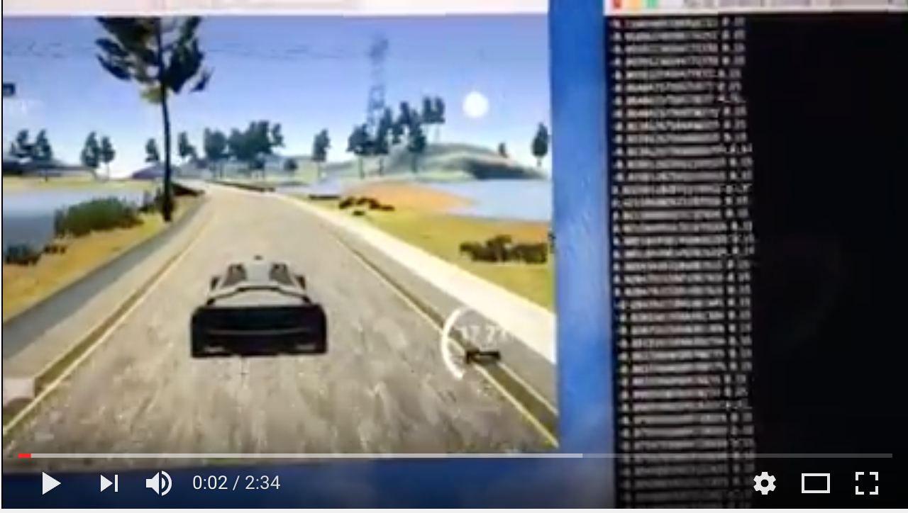
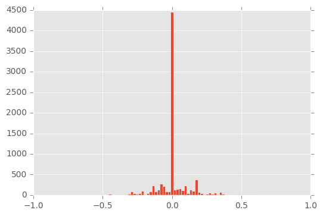
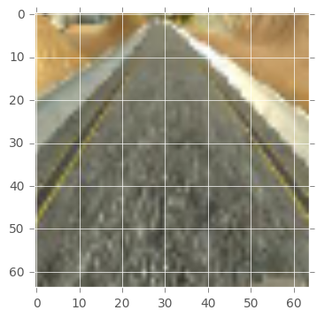
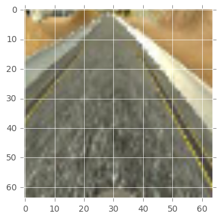
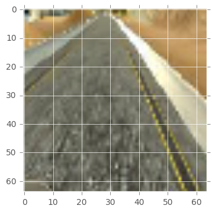
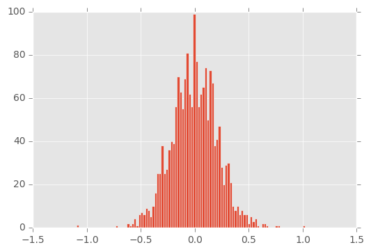

# Udacity Self Driving Car Nanodegree:
This is my implementaion for the behavioral cloning project.

# File structure

drive.py - The script to drive the car. To be run as, ```python drive.py model.json```    
model.ipynb - The jupyter notebook used to create and train the model.     
model.json - The model architecture.    
model.h5 - The model weights.    
README.md - This file containing details of model training.    
/files - Folder for README.md.    
/data -  Folder for the training data. NOTE: There is not on Github. This project uses the udacity track-1 sample data. You can download [here]( https://d17h27t6h515a5.cloudfront.net/topher/2016/December/584f6edd_data/data.zip).   

# Results

[](http://www.youtube.com/watch?v=KEnraN9jZYM)

# Strategy

My approach was inspired by [Mojtaba Vàlipour's Blog](https://medium.com/@ValipourMojtaba/my-approach-for-project-3-2545578a9319#.40pxekkl8).

Initially I used my drving-log data. After repeating trial and error, I found that the udacity sample data works good for this project. For the following reasons, I thought that the augmentation of the training data is necessary.

1. The most of the data are going straight scenes. The rest are turning left scenes. 
2. The data that can be acquired at once is about 4000.
3. I am not good at playing games and can not keep taking the driving-log steadily.　

I tried visualizing the training data. Looking at the below graph, going straight scenes account for more than 90% of the whole. I desided to generate more training data with normal distribution with no bias. 



# Augmentation

My first approach was to use three camera's images on the car. 
It was based on the below.

~~~~
6. Recovery and Multiple Cameras(from Udacity P-3 Lesson)

You also might wonder why there are three cameras on the car: center, left, and right.
That’s because of the issue of recovering from being off-center.
In the simulator, you can weave all over the road and turn recording on and off. 
In a real car, however, that’s not really possible. At least not legally.
So in a real car, we’ll have multiple cameras on the vehicle, and we’ll map recovery paths from each camera.
~~~~

I adjusted the steering value to the right(plus) on the the left camera image. And I adjusted the steering value to the left(minus) and on the right camera image. The adjustment value(-1.5/+1.5) was determined from the screen of the simulator and actual operation.

### Example
#### left camera :steering: 0.10923153(adjust=-1.5)


#### center camera :steering: -0.04076847(adjust=0.0)


#### right camera :steering: -0.19076847(adjust=+1.5)


The secound approach is preprocessing using OpenCV. I used three technics.

1. Translation
2. Flipping 
3. Brightness adjusment

Especially about translation, I used [vivek's blog](https://chatbotslife.com/using-augmentation-to-mimic-human-driving-496b569760a9#.cwnuen1pg) as a guide to get a normal distribution steering value. 

~~~~
[Translation code]
    rows, cols, _ = image.shape
    trans_x_range = 10
    trans_y_range = 4
    adj_str = 0.05
    trans_x = trans_x_range * np.random.uniform() - trans_x_range/2
    trans_y = trans_y_range * np.random.uniform() - trans_y_range/2
    trans_mat = np.float32([[1,0, trans_x], [0,1, trans_y]])
    image = cv2.warpAffine(image, trans_mat, (cols, rows))
    
    steering = steering + trans_x/trans_x_range * adj_str
~~~~

### Exsample
#### Ramdom Translatiom/Flipping/Brightness adjustment image.


After that, except for 90% straight data from all the data, the data of the distribution as shown below was completed.



# Model archtecure

For the network architecture I used the CNN model that evolved from a previous project for classifying traffic signs.
Because I thought that the power of 2 is easier to stack layers and I can do simple learning.
The structure is as follows.

|Layer (type)                     |Output Shape          |Param #     |Note                          |   
|---------------------------------|----------------------|------------|------------------------------|
|lambda_2 (Lambda)                |(None, 64, 64, 3)     |0           |                              |             
|convolution2d_4 (Convolution2D)  |(None, 32, 32, 32)    |896         |kernel_size=(3,3)             |   
|activation_3 (Activation)        |(None, 32, 32, 32)    |0           |relu                          |   
|maxpooling2d_3 (MaxPooling2D)    |(None, 31, 31, 32)    |0           |pool_size=(2,2)               |   
|convolution2d_5 (Convolution2D)  |(None, 16, 16, 64)    |18496       |kernel_size=(3,3)             |   
|relu2 (Activation)               |(None, 16, 16, 64)    |0           |relu                          |   
|maxpooling2d_4 (MaxPooling2D)    |(None, 8, 8, 64)      |0           |pool_size=(2,2)               |   
|convolution2d_6 (Convolution2D)  |(None, 8, 8, 128)     |73856       |kernel_size=(3,3)             |   
|activation_4 (Activation)        |(None, 8, 8, 128)     |0           |relu                          |   
|maxpooling2d_5 (MaxPooling2D)    |(None, 4, 4, 128)     |0           |pool_size=(2,2)               |      
|flatten_1 (Flatten)              |(None, 2048)          |0           |                              |   
|dropout_1 (Dropout)              |(None, 2048)          |0           |dropout=(0.5)                 |   
|dense_1 (Dense)                  |(None, 128)           |262272      |                              |   
|activation_5 (Activation)        |(None, 128)           |0           |relu                          |   
|dropout_2 (Dropout)              |(None, 128)           |0           |dropout=(0.5)                 |   
|dense_2 (Dense)                  |(None, 128)           |16512       |                              |   
|dense_3 (Dense)                  |(None, 1)             |129         |                              |   
||||
|Total params: 372,161

# Training 

The center camera raw images(no augmentaion) are used for validation. And I used an Adam optimizer for training. 
The final training images are then generated in batches of 200 on the fly with 20000 images per epoch. A python generator creates new training batches by the above OpenCV preprocessing.

~~~~
Epoch 1/5
20000/20000 [==============================] - 148s - loss: 0.0323 - val_loss: 5.7618e-04
Epoch 2/5
20000/20000 [==============================] - 152s - loss: 0.0210 - val_loss: 4.6232e-04
Epoch 3/5
20000/20000 [==============================] - 148s - loss: 0.0185 - val_loss: 7.7319e-04
Epoch 4/5
20000/20000 [==============================] - 157s - loss: 0.0180 - val_loss: 0.0098
Epoch 5/5
20000/20000 [==============================] - 147s - loss: 0.0176 - val_loss: 0.0034
~~~~

It was possible to divide the data in advance and use it as validation data, but it was not very effective. Was it better to use another test data?

# Reflection

It was a very difficult project which made various approaches.
Even if the result of learning is good, self driving does not go well.
I would like to challenge realistic self driving simulation by combining with other sensors.
