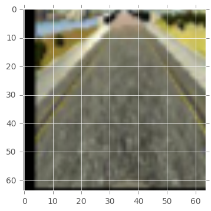

# Udacity Self Driving Car Nanodegree:
This is my implementaion for the behavioral cloning project.

# File structure:

drive.py - The script to drive the car. To be run as, ```python drive.py model.json```    
model.ipynb - The jupyter notebook used to create and train the model.     
model.json - The model architecture.    
model.h5 - The model weights.    
README.md - This file containing details of model training.    
/files - Folder for README.md.    
/data -  Folder for the training data. NOTE: There is not on Github. This project uses the udacity track-1 sample data. You can get [here]( https://d17h27t6h515a5.cloudfront.net/topher/2016/December/584f6edd_data/data.zip).   

# Strategy


# Augmentation





# Model archtecure

|Layer (type)                     |Output Shape          |Param #     |Note                          |   
|---------------------------------|----------------------|------------|------------------------------|
|lambda_2 (Lambda)                |(None, 64, 64, 3)     |0           |                              |             
|convolution2d_4 (Convolution2D)  |(None, 32, 32, 32)    |896         |kernel_size=(3,3)             |   
|activation_3 (Activation)        |(None, 32, 32, 32)    |0           |relu                          |   
|maxpooling2d_3 (MaxPooling2D)    |(None, 31, 31, 32)    |0           |pool_size=(2,2)               |   
|convolution2d_5 (Convolution2D)  |(None, 16, 16, 64)    |18496       |kernel_size=(3,3)             |   
|relu2 (Activation)               |(None, 16, 16, 64)    |0           |relu                          |   
|maxpooling2d_4 (MaxPooling2D)    |(None, 8, 8, 64)      |0           |pool_size=(2,2)               |   
|convolution2d_6 (Convolution2D)  |(None, 8, 8, 128)     |73856       |kernel_size=(3,3)             |   
|activation_4 (Activation)        |(None, 8, 8, 128)     |0           |relu                          |   
|maxpooling2d_5 (MaxPooling2D)    |(None, 4, 4, 128)     |0           |pool_size=(2,2)               |      
|flatten_1 (Flatten)              |(None, 2048)          |0           |                              |   
|dropout_1 (Dropout)              |(None, 2048)          |0           |dropout=(0.5)                 |   
|dense_1 (Dense)                  |(None, 128)           |262272      |                              |   
|activation_5 (Activation)        |(None, 128)           |0           |relu                          |   
|dropout_2 (Dropout)              |(None, 128)           |0           |dropout=(0.5)                 |   
|dense_2 (Dense)                  |(None, 128)           |16512       |                              |   
|dense_3 (Dense)                  |(None, 1)             |129         |                              |   
||||
|Total params: 372,161

# Training 
# Results
# Conclusions
